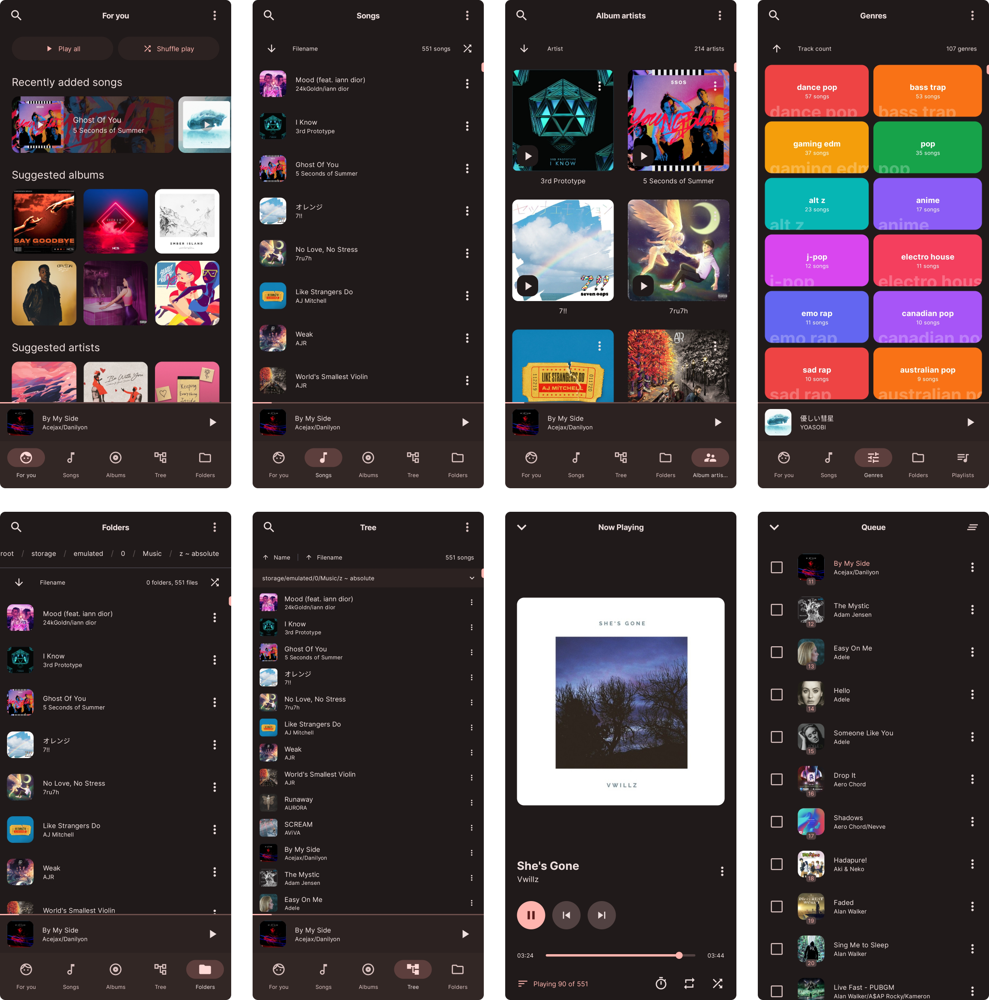

    

    
    

<h1 align="center">Symphony</h1>

🎵 Lightweight, elegant music player that enhances your offline music experience. Supports Android 9 and later.

 

    

## Why?

Why was this created? As I was getting into offline music, most of the popular good-looking music players did not support filename/path based sorting, which is what I really needed to keep my music organized. So I must have forked them and added it right? I could have done that but, I felt like trying out Kotlin and Compose, so I ended up making my own.
